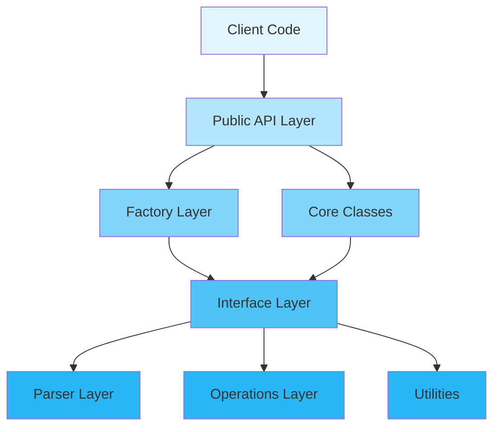
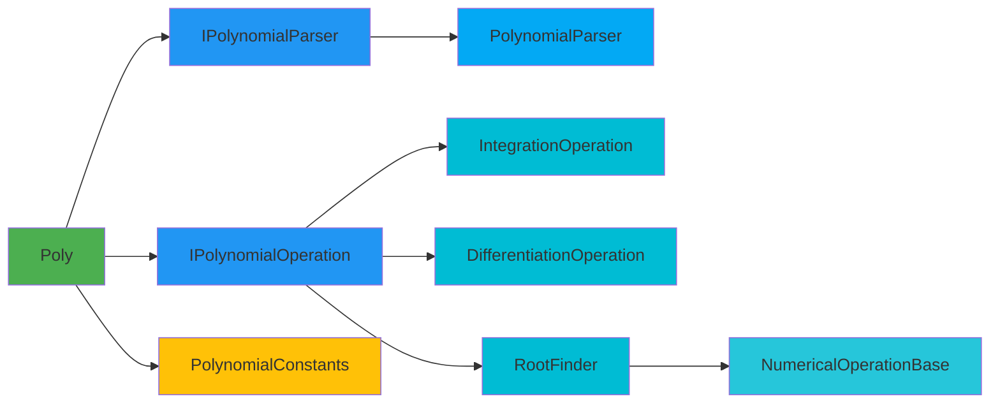
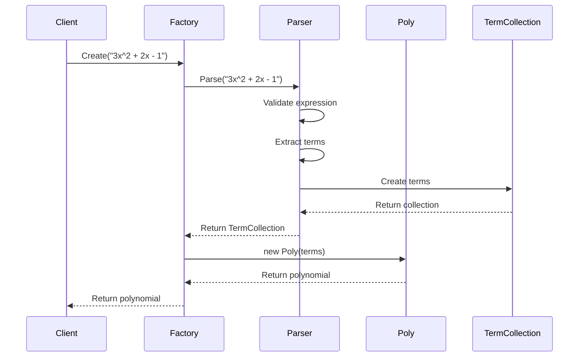
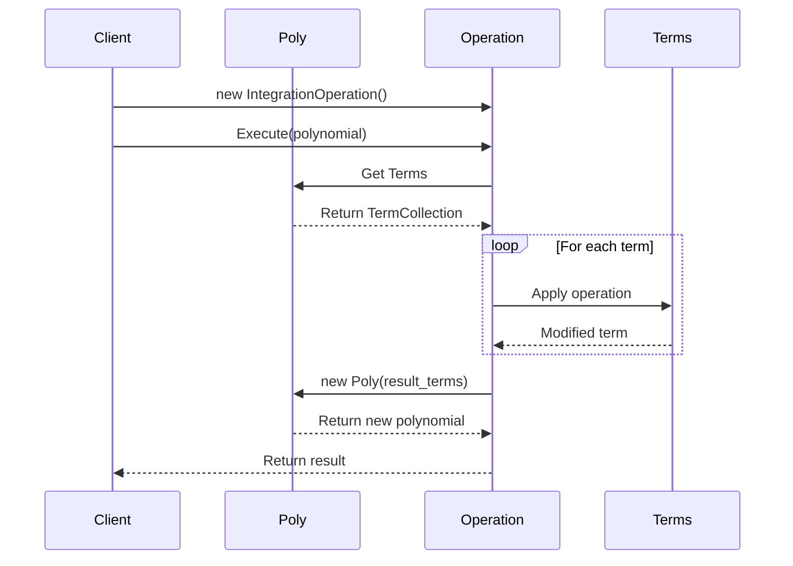
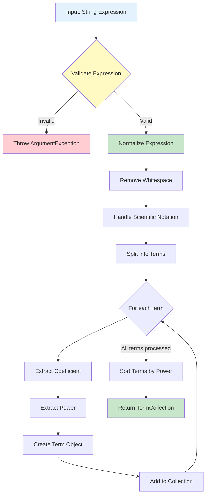
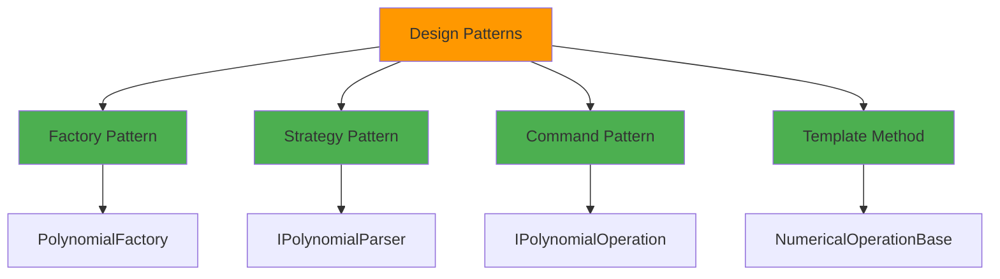

# Polynomial Library

[](https://www.gnu.org/licenses/gpl-3.0)
[]()
[]()

A comprehensive C# library for advanced operations with polynomial expressions. This project is based on Morteza Alikhani's [Polynomial.Net](https://www.codeproject.com/Articles/83394/Polynomial-Net) project and has been significantly enhanced with modern design patterns, SOLID principles, and extensive functionality.

## Table of Contents

- [Overview](#overview)
- [Key Features](#key-features)
- [Project Structure](#project-structure)
- [Architecture](#architecture)
- [Getting Started](#getting-started)
- [Usage Examples](#usage-examples)
- [Developer Guide](#developer-guide)
- [Contributing](#contributing)
- [License](#license)

## Overview

The Polynomial library provides a robust framework for working with mathematical polynomials in C#. It supports creation, manipulation, and advanced mathematical operations on polynomial expressions with a clean, extensible architecture.

### Recent Improvements

This library has been extensively refactored to apply **SOLID principles** and modern design patterns:
- ✅ Interface-based design for better abstraction and testability
- ✅ Separation of concerns across dedicated layers
- ✅ Extensible operations using the Strategy and Command patterns
- ✅ Factory pattern for clean object creation
- ✅ No magic numbers - all constants are centralized
- ✅ Improved performance with O(n log n) sorting algorithms
- ✅ Comprehensive test coverage

For detailed improvement documentation, see [SOLID_IMPROVEMENTS.md](SOLID_IMPROVEMENTS.md) and [ARCHITECTURE.md](ARCHITECTURE.md).

## Key Features

### 🎯 Core Capabilities
- **Polynomial Parsing**: Parse string expressions into polynomial objects
- **Mathematical Operations**: Integration, differentiation, addition, subtraction, multiplication
- **Root Finding**: Numerical methods to find polynomial roots
- **Evaluation**: Calculate polynomial values at specific points
- **Extrema Detection**: Find maximum and minimum points

### 🏗️ Architecture Features
- **Interface-Based Design**: `IPolynomial`, `ITerm`, `IPolynomialParser`, `IPolynomialOperation<T>`
- **Separation of Concerns**: Distinct layers for parsing, operations, and core logic
- **Extensibility**: Add new operations without modifying existing code (Open/Closed Principle)
- **Factory Pattern**: `PolynomialFactory` for flexible object creation
- **Dependency Injection**: Support for custom parsers and operations
- **Constants Management**: Centralized configuration through `PolynomialConstants`

### 🚀 Performance
- Efficient O(n log n) sorting for term collections
- Optimized numerical algorithms for root finding
- Memory-efficient implementation with no unnecessary finalizers

## Project Structure

```
Polynomial/
├── Polynomial/                          # Main library project
│   ├── Interfaces/                      # Core abstractions (ISP, DIP)
│   │   ├── IPolynomial.cs              # Contract for polynomial behavior
│   │   ├── ITerm.cs                    # Contract for term representation
│   │   ├── IPolynomialParser.cs        # Contract for parsing strategies
│   │   └── IPolynomialOperation.cs     # Contract for extensible operations
│   │
│   ├── Parsers/                        # Parsing logic (SRP)
│   │   └── PolynomialParser.cs         # Validates and parses polynomial expressions
│   │
│   ├── Operations/                     # Mathematical operations (SRP, OCP)
│   │   ├── IntegrationOperation.cs     # Integration implementation
│   │   ├── DifferentiationOperation.cs # Differentiation implementation
│   │   ├── RootFinder.cs               # Root-finding algorithms
│   │   ├── NumericalOperationBase.cs   # Base class for numerical operations
│   │   └── PolynomialConstants.cs      # Centralized constants and tolerances
│   │
│   ├── Factories/                      # Object creation (Factory Pattern)
│   │   └── PolynomialFactory.cs        # Creates polynomial instances with DI support
│   │
│   ├── Core Classes/                   # Domain models
│   │   ├── Poly.cs                     # Main polynomial class (implements IPolynomial)
│   │   ├── Term.cs                     # Represents a single term (implements ITerm)
│   │   ├── TermCollection.cs           # Collection of terms
│   │   ├── PiecewisePoly.cs            # Piecewise polynomial support
│   │   ├── ConjugatePoly.cs            # Complex conjugate polynomials
│   │   ├── ConjugateTerm.cs            # Complex conjugate terms
│   │   ├── ConjugateTermCollection.cs  # Collection of conjugate terms
│   │   ├── PiecewiseConjugatePoly.cs   # Piecewise conjugate polynomials
│   │   └── Algebra.cs                  # Algebraic utility functions
│   │
│   └── Properties/
│       └── AssemblyInfo.cs             # Assembly metadata
│
├── Polynomial.Tests/                   # Unit tests project
│   ├── PolyTests.cs                    # Tests for Poly class
│   ├── TermTests.cs                    # Tests for Term class
│   ├── PolynomialParserTests.cs        # Tests for parser functionality
│   ├── IntegrationOperationTests.cs    # Tests for integration operations
│   ├── DifferentiationOperationTests.cs # Tests for differentiation operations
│   ├── PolynomialFactoryTests.cs       # Tests for factory pattern
│   └── README.md                       # Test documentation
│
├── Documentation/                      # Architecture documentation
│   ├── ARCHITECTURE.md                 # Detailed architecture guide
│   ├── SOLID_IMPROVEMENTS.md           # SOLID principles documentation
│   └── REFACTORING_SUMMARY.md          # Refactoring history
│
├── Polynomial.sln                      # Visual Studio solution file
└── README.md                           # This file

Statistics:
- Total Source Files: ~20 C# files
- Lines of Code: ~4,600+ lines
- Test Coverage: Comprehensive unit tests for core functionality
```

### Namespace Organization

```
Polynomial
├── Polynomial.Interfaces           # All interface definitions
├── Polynomial.Parsers              # Parsing implementations
├── Polynomial.Operations           # Mathematical operation implementations
├── Polynomial.Factories            # Factory pattern implementations
└── Polynomial (root)               # Core domain classes
```

## Architecture

The library follows a **layered architecture** with clear separation of concerns:



### Component Interaction



### Polynomial Creation Workflow



### Operation Execution Flow



### Parsing Mechanism



## Getting Started

### Prerequisites

- .NET Framework 4.8 or higher
- Visual Studio 2019 or later (recommended)
- C# 7.0 to 7.3 (compatible with .NET Framework 4.8)

### Installation

#### Option 1: Clone from GitHub

```bash
git clone https://github.com/obirler/Polynomial.git
cd Polynomial
```

#### Option 2: Add as Reference

1. Download the latest release
2. Add reference to `Polynomial.dll` in your project

### Building the Project

```bash
# Build solution
dotnet build Polynomial.sln

# Build in Release mode
dotnet build Polynomial.sln --configuration Release

# Run tests
dotnet test Polynomial.Tests/Polynomial.Tests.csproj
```

### Quick Start

```csharp
using Polynomial;
using Polynomial.Factories;
using Polynomial.Operations;

// Create a polynomial
var poly = new Poly("3x^2 + 2x - 1");

// Evaluate at x = 2
double result = poly.Calculate(2.0); // Returns 15.0

// Differentiate
var derivative = poly.Derivate(); // Returns "6x+2"

// Integrate
var integral = poly.Integrate(); // Returns "x^3+x^2-x"
```

## Usage Examples

### Creating Polynomials

```csharp
// Method 1: Direct instantiation (traditional)
var poly1 = new Poly("3x^2 + 2x - 1");

// Method 2: With domain boundaries
var poly2 = new Poly("x^2 + 1", 0, 10);

// Method 3: Using Factory (recommended for DI)
var factory = new PolynomialFactory();
var poly3 = factory.Create("3x^2 + 2x - 1");
var poly4 = factory.Create("x^2", 0, 10);

// Method 4: From existing terms
var terms = new TermCollection();
terms.Add(new Term(2, 3));  // 3x^2
terms.Add(new Term(1, 2));  // 2x
terms.Add(new Term(0, -1)); // -1
var poly5 = new Poly(terms);

// Method 5: Using custom parser
var customParser = new PolynomialParser();
var customFactory = new PolynomialFactory(customParser);
var poly6 = customFactory.Create("2x^3 - 4x + 7");
```

### Basic Operations

```csharp
var poly = new Poly("x^2 + 2x + 1");

// Calculate value
double value = poly.Calculate(3.0); // Returns 16.0

// Get degree
double degree = poly.Degree(); // Returns 2

// Check properties
bool isConstant = poly.IsConstant(); // Returns false
bool isLinear = poly.IsLinear();     // Returns false

// String representation
string expression = poly.ToString(); // Returns "x^2+2x+1"
```

### Mathematical Operations

```csharp
var poly1 = new Poly("x^2 + 2x + 1");
var poly2 = new Poly("x - 1");

// Addition
var sum = poly1 + poly2;

// Subtraction
var difference = poly1 - poly2;

// Multiplication
var product = poly1 * poly2;

// Division (returns quotient and remainder)
Poly quotient, remainder;
poly1.Divide(poly2, out quotient, out remainder);
```

### Calculus Operations

```csharp
var poly = new Poly("x^3 + 2x^2 + x");

// Method 1: Using instance methods
var derivative = poly.Derivate();   // Returns "3x^2+4x+1"
var integral = poly.Integrate();     // Returns "0.25x^4+0.667x^3+0.5x^2"

// Method 2: Using operation classes (more testable)
var diffOp = new DifferentiationOperation();
var intOp = new IntegrationOperation();

var derivative2 = diffOp.Execute(poly);
var integral2 = intOp.Execute(poly);
```

### Finding Roots

```csharp
var poly = new Poly("x^2 - 5x + 6"); // Roots at x=2 and x=3

// Method 1: Using instance method
var roots = poly.Roots();

// Method 2: Using operation class
var rootFinder = new RootFinder();
var roots2 = rootFinder.Execute(poly);

// Display roots
foreach (var root in roots)
{
    Console.WriteLine($"Root found at x = {root}");
}
```

### Finding Extrema

```csharp
var poly = new Poly("x^2 - 4x + 3", -10, 10);

// Find maximum
double maxX = poly.Maximum();
double maxValue = poly.Calculate(maxX);
Console.WriteLine($"Maximum at x = {maxX}, value = {maxValue}");

// Find minimum
double minX = poly.Minimum();
double minValue = poly.Calculate(minX);
Console.WriteLine($"Minimum at x = {minX}, value = {minValue}");
```

### Advanced: Custom Operations

```csharp
using Polynomial.Interfaces;
using Polynomial.Operations;

// Define a custom operation
public class DoublePolynomialOperation : IPolynomialOperation<Poly>
{
    public Poly Execute(IPolynomial polynomial)
    {
        var poly = polynomial as Poly;
        if (poly == null) return null;

        var terms = new TermCollection();
        foreach (Term t in poly.Terms)
        {
            terms.Add(new Term(t.Power, t.Coefficient * 2));
        }
        return new Poly(terms);
    }
}

// Use the custom operation
var poly = new Poly("x^2 + 2x + 1");
var doubleOp = new DoublePolynomialOperation();
var doubled = doubleOp.Execute(poly); // Returns "2x^2+4x+2"
```

## Developer Guide

### Architecture Principles

This library follows **SOLID principles**:

1. **Single Responsibility Principle (SRP)**
   - Each class has one reason to change
   - Parser, operations, and domain logic are separated
   - Example: `PolynomialParser` only handles parsing

2. **Open/Closed Principle (OCP)**
   - Open for extension, closed for modification
   - New operations can be added without changing existing code
   - Use `IPolynomialOperation<T>` to create new operations

3. **Liskov Substitution Principle (LSP)**
   - Interfaces define clear contracts
   - Any implementation can be substituted
   - Example: Any `IPolynomialParser` works with `PolynomialFactory`

4. **Interface Segregation Principle (ISP)**
   - Focused interfaces instead of monolithic ones
   - Clients depend only on what they use
   - Separate interfaces: `IPolynomial`, `ITerm`, `IPolynomialParser`, etc.

5. **Dependency Inversion Principle (DIP)**
   - Depend on abstractions, not concrete implementations
   - High-level modules use interfaces
   - Example: `PolynomialFactory` accepts `IPolynomialParser`

### Design Patterns Used



### Extending the Library

#### Adding a New Parser

```csharp
using Polynomial.Interfaces;

public class LaTeXParser : IPolynomialParser
{
    public bool Validate(string expression)
    {
        // Validation logic for LaTeX format
        return true;
    }

    public TermCollection Parse(string expression)
    {
        // Parse LaTeX format: x^{2} + 2x + 1
        // Implementation here
        return new TermCollection();
    }
}

// Usage
var factory = new PolynomialFactory(new LaTeXParser());
var poly = factory.Create("x^{2} + 2x + 1");
```

#### Adding a New Operation

```csharp
using Polynomial.Interfaces;

public class SecondDerivativeOperation : IPolynomialOperation<Poly>
{
    public Poly Execute(IPolynomial polynomial)
    {
        var diffOp = new DifferentiationOperation();
        var firstDerivative = diffOp.Execute(polynomial);
        var secondDerivative = diffOp.Execute(firstDerivative);
        return secondDerivative;
    }
}

// Usage
var poly = new Poly("x^3 + 2x^2");
var secondDiff = new SecondDerivativeOperation();
var result = secondDiff.Execute(poly); // Returns "6x+4"
```

### Testing Guidelines

The project uses MSTest for unit testing. Tests are organized by class:

```csharp
[TestClass]
public class CustomOperationTests
{
    [TestMethod]
    public void Execute_ValidPolynomial_ReturnsExpectedResult()
    {
        // Arrange
        var poly = new Poly("x^2 + 1");
        var operation = new CustomOperation();

        // Act
        var result = operation.Execute(poly);

        // Assert
        Assert.IsNotNull(result);
        Assert.AreEqual(expectedValue, result.Calculate(0));
    }
}
```

### Performance Considerations

- **Sorting**: Uses O(n log n) algorithms for term sorting
- **Memory**: No finalizers to reduce GC pressure
- **Immutability**: Operations return new instances (thread-safe)
- **Numerical Operations**: Configurable tolerance via `PolynomialConstants`

### Configuration Constants

All configuration values are centralized in `PolynomialConstants`:

```csharp
public static class PolynomialConstants
{
    public const double RootTolerance = 1e-10;
    public const int DefaultSteps = 1000;
    public const double ComparisonTolerance = 1e-9;
}
```

## Contributing

Contributions are welcome! Please follow these guidelines:

1. Fork the repository
2. Create a feature branch (`git checkout -b feature/amazing-feature`)
3. Follow SOLID principles and existing code style
4. Add unit tests for new functionality
5. Ensure all tests pass
6. Update documentation as needed
7. Commit your changes (`git commit -m 'Add amazing feature'`)
8. Push to the branch (`git push origin feature/amazing-feature`)
9. Open a Pull Request

### Code Style

- Use meaningful variable names
- Follow C# naming conventions
- Add XML documentation comments for public APIs
- Keep methods focused and small (SRP)
- Prefer composition over inheritance

## License

This project is licensed under the GNU General Public License v3.0 - see the [LICENSE](LICENSE) file for details.

## Acknowledgments

- Original project by Morteza Alikhani: [Polynomial.Net](https://www.codeproject.com/Articles/83394/Polynomial-Net)
- Enhanced and refactored by Omer Birler
- Contributors: See GitHub contributors list

## Further Reading

- [ARCHITECTURE.md](ARCHITECTURE.md) - Detailed architecture documentation
- [SOLID_IMPROVEMENTS.md](SOLID_IMPROVEMENTS.md) - SOLID principles implementation details
- [REFACTORING_SUMMARY.md](REFACTORING_SUMMARY.md) - History of refactoring changes

---

**Made with ❤️ by the Polynomial team**

